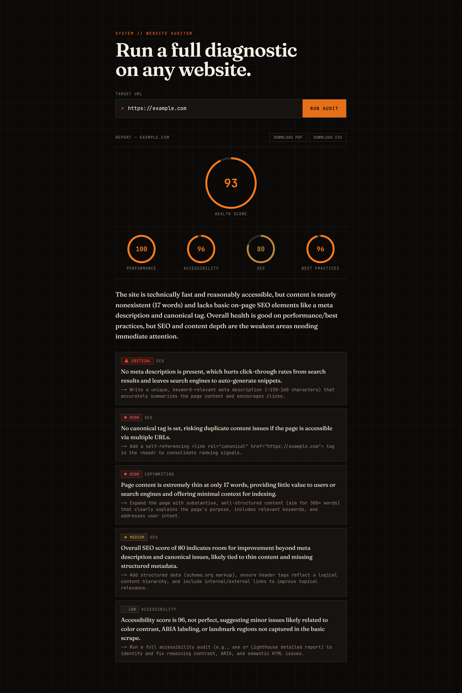

<div align="center">

[English](README.md) · **العربية**

</div>

# مُدقّق المواقع بالذكاء الاصطناعي

الصق رابطاً، لتحصل خلال عشر ثوانٍ تقريباً على تدقيق للموقع: درجة صحّة
(Health Score)، وتفصيل للأداء وإتاحة الوصول وتحسين محركات البحث وأفضل
الممارسات مأخوذ من بيانات Google PageSpeed Insights الحقيقية، وملخّص يكتبه
Claude، وقائمة إصلاحات مرتّبة حسب الخطورة. صدّر التقرير كـ PDF أو CSV.

**🔗 الموقع المباشر:** https://ai-website-auditor-indol.vercel.app

تصميم وتطوير بالكامل: **محمد الطنسي** — [لينكدإن](https://www.linkedin.com/in/mohammed-altounsi/)

---

## لقطة



## القرار التصميمي الأساسي

درجة الصحّة لا يولّدها النموذج إطلاقاً. هي `Math.round()` لمتوسّط درجات
PageSpeed Insights الأربع الحقيقية، تُحسب في الكود في كل مرة يُدقَّق فيها
الموقع نفسه. Claude يكتب الملخّص وقائمة الإصلاحات فقط — وكل ما يجب أن يبقى
ثابتاً بين التشغيلات هو حساب، لا تخمين من نموذج لغوي. هذا الفصل (النموذج
يشرح، والكود يقرّر) هو النمط الذي وُجد المشروع ليُثبته.

## كيف يعمل

1. **`lib/scrape.ts`** — يجلب الصفحة المستهدفة ويستخرج إشارات تحسين محركات
   البحث داخل الصفحة (العنوان، وصف الميتا، عدد العناوين، تغطية النص البديل،
   وسم canonical) باستخدام `cheerio`. يتضمّن تحليل DNS، وحجب نطاقات عناوين
   IP، وتثبيت الاتصال، حتى لا يُستخدم رابطٌ من المستخدم للوصول إلى عناوين
   شبكة داخلية/خاصة (حماية SSRF) — المُدقّق يقبل أي رابط عام، فوجب حلّ هذا
   كما ينبغي لا تخطّيه.
2. **`lib/pagespeed.ts`** — يستدعي واجهة Google PageSpeed Insights للحصول
   على الدرجات الأربع الموضوعية، ثم يحسب درجة الصحّة كمتوسّط لها.
3. **`lib/analyze.ts`** — يرسل بيانات الاستخراج وPageSpeed إلى Claude عبر
   الاستخدام الإجباري للأداة (`tool_choice: { type: 'tool' }`)، فتكون
   الاستجابة دائماً كائناً منظّماً مُتحقَّقاً منه، لا نصاً حرّاً يُحلَّل.
4. **`app/api/audit/route.ts`** — يشغّل خط المعالجة ويعيد تقريراً واحداً بصيغة JSON.
5. **`app/page.tsx` + `app/components/*`** — نموذج الرابط، ومؤشّر متحرّك
   لدرجة الصحّة، وتفصيل الفئات، وقائمة إصلاحات موسومة بالخطورة، وتصدير PDF
   (طباعة المتصفّح) وCSV.

## التقنيات

Next.js (App Router) + TypeScript + Tailwind، وواجهة Google PageSpeed
Insights، وواجهة Anthropic (`claude-sonnet-5`، استخدام إجباري للأداة)،
وVitest + Testing Library.

## التشغيل

```bash
npm install
cp .env.local.example .env.local
# ضع ANTHROPIC_API_KEY (console.anthropic.com)
# ضع PAGESPEED_API_KEY (console.cloud.google.com — فعّل "PageSpeed Insights API")
npm run dev
```

## الاختبار

```bash
npm test
```

## تحسينات مستقبلية

- حفظ التدقيقات السابقة (Postgres/Supabase) ليعود المستخدم إلى تقرير عبر رابط.
- وضع مقارنة المنافسين — تدقيق رابطين ومقارنة الإصلاحات.
- فحص ظهور الموقع لزواحف الذكاء الاصطناعي (GEO) — هل يجده ويستشهد به ChatGPT/Perplexity/Gemini.
- درجة صحّة مُرجّحة عندما يُظهر الاستخدام الحقيقي أي فئة يجب أن تزن أكثر.
- استبدال استراتيجية PSI للجوال فقط بمبدّل بين الجوال وسطح المكتب.
- تحديد المعدّل حسب عنوان IP (Vercel KV) عند وصول استخدام حقيقي.
