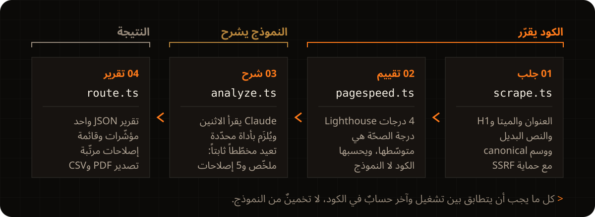

<div align="left">

[English](README.md) · **العربية**

</div>

<p align="center">
  <a href="https://ai-website-auditor-indol.vercel.app">
    
  </a>
</p>

<p align="center">
  <a href="https://ai-website-auditor-indol.vercel.app"></a>
  
  
  
  
</p>

<div dir="rtl">

<p align="center">
  <a href="https://ai-website-auditor-indol.vercel.app"><b>جرّب الموقع المباشر</b></a> ·
  <a href="#التشغيل-المحلي">التشغيل المحلي</a> ·
  <a href="#كيف-يجري-التدقيق">كيف يعمل</a>
</p>

تطبيق Next.js لتدقيق المواقع. تُدخل رابط الموقع، فيجلب التطبيق من Google
PageSpeed Insights أربع درجات: الأداء، وإتاحة الوصول، وSEO، وأفضل الممارسات.
ثم يحسب متوسّطها ويعرضه على أنه درجة الصحّة. بعدها يرسل الدرجات مع بعض
فحوصات SEO في الصفحة إلى Claude، فيكتب ملخّصاً قصيراً وأهم خمسة إصلاحات،
ولكل إصلاح مستوى خطورة. ويمكن تنزيل التقرير بصيغة PDF أو CSV.

## مثال: stripe.com

<p align="center">
  
</p>

اللقطة من النسخة المنشورة من التطبيق. الدرجات الأربع هي الأرقام التي أعادها
PageSpeed، والرقم 73 في المنتصف متوسّطها بعد التقريب.

## طريقة حساب درجة الصحّة

يجمع `lib/pagespeed.ts` درجات PageSpeed الأربع، ويقسم المجموع على أربعة، ثم
يقرّب الناتج بدالة `Math.round()`. لا يشارك Claude في هذه الخطوة. فإذا أعاد
PageSpeed الأرقام الأربعة نفسها، خرجت درجة الصحّة نفسها. ويقتصر عمل Claude على
كتابة الملخّص وقائمة الإصلاحات.

## كيف يجري التدقيق

<p align="center">
  
</p>

<details>
<summary><b>وظيفة كل ملف</b></summary>

1. **`lib/scrape.ts`** يجلب الصفحة المستهدفة ويستخرج إشارات SEO داخل
   الصفحة باستخدام `cheerio`: العنوان، ووصف الميتا، وعدد عناوين H1، وتغطية
   النص البديل للصور، ووسم canonical، ووسم viewport، وعدد الكلمات.
2. **`lib/pagespeed.ts`** يستدعي واجهة PageSpeed Insights (بإعدادات
   الجوال) للحصول على درجات الفئات الأربع. إذا ردّت الواجهة بخطأ 5xx يكرّر
   الطلب، بحدّ أقصى ثلاث محاولات. ويحسب كذلك درجة الصحّة.
3. **`lib/analyze.ts`** يرسل بيانات الاستخراج وPageSpeed إلى Claude مع
   إلزامه باستخدام الأداة (`tool_choice: { type: 'tool' }`). أي أن Claude
   يجب أن يردّ باستدعاء أداة `submit_audit_report`، فيقرأ التطبيق كائن JSON
   يطابق مخطّط الأداة بدل أن يحلّل نصاً حرّاً.
4. **`app/api/audit/route.ts`** يشغّل المراحل ويعيد تقرير JSON واحداً.
5. **`app/page.tsx` و`app/components/*`** تعرض نموذج الرابط، ومؤشّر درجة
   الصحّة المتحرّك، وتفصيل الفئات، وقائمة الإصلاحات بشارات الخطورة، وتصدير
   PDF (عبر طباعة المتصفّح) وCSV.

</details>

## التعامل مع الروابط غير الموثوقة

يجلب التطبيق أي رابط عام يكتبه الزائر. الفحوصات التالية موجودة في
`lib/scrape.ts`، ما عدا فحص CSV فمكانه `lib/exportCsv.ts`:

- **SSRF.** يحلّ اسم النطاق أولاً، ويحجب العناوين الخاصة وعناوين loopback
  وlink-local وعناوين IPv6 المرتبطة بـ IPv4. ثم يتصل بالعنوان نفسه الذي
  فحصه. وإذا أشار نطاق عام إلى `169.254.169.254` يرفض الطلب.
- **إعادة التوجيه.** يتبع حتى 5 عمليات إعادة توجيه يدوياً ويفحص كل خطوة،
  فلا يستطيع رابط عام أن يقود إلى عنوان داخلي.
- **الحدود.** ينتهي كل طلب جلب بعد 15 ثانية، ويتوقّف عن القراءة عند 5
  ميغابايت.
- **تصدير CSV.** يضيف علامة `'` في بداية أي خلية تبدأ بـ `=` أو `+` أو `-`
  أو `@`، حتى لا ينفّذها برنامج الجداول على أنها صيغة.

## التشغيل المحلي

تحتاج إلى Node.js، و[مفتاح Anthropic API](https://console.anthropic.com)،
و[مفتاح Google Cloud](https://console.cloud.google.com) مع تفعيل PageSpeed
Insights API.

</div>

```bash
npm install
cp .env.local.example .env.local
# set ANTHROPIC_API_KEY and PAGESPEED_API_KEY in .env.local
npm run dev
```

<div dir="rtl">

تشغيل الاختبارات:

</div>

```bash
npm test
```

<div dir="rtl">

## التقنيات

Next.js 16 (App Router)، وTypeScript، وTailwind CSS 4، وواجهة Google
PageSpeed Insights، وواجهة Anthropic بنموذج `claude-sonnet-5` مع الاستخدام
الإجباري للأداة، وVitest مع Testing Library.

<details>
<summary><b>الخطوات القادمة</b></summary>

- حفظ التدقيقات السابقة (Postgres أو Supabase) ليعود المستخدم إلى أي تقرير عبر رابط.
- وضع المقارنة: تدقيق رابطين ومقارنة الإصلاحات بينهما.
- فحص الظهور لزواحف الذكاء الاصطناعي (GEO): هل يجد ChatGPT وPerplexity وGemini الصفحة ويستشهدون بها.
- درجة صحّة مُرجّحة حين يكشف الاستخدام الفعلي أي فئة تستحق وزناً أكبر.
- خيار للتبديل بين الجوال وسطح المكتب في PageSpeed بدل الجوال وحده.
- تحديد عدد الطلبات لكل عنوان IP (Vercel KV) حين تصل زيارات حقيقية.

</details>

---

<p align="center">
  تصميم وتطوير: <b>محمد التونسي</b> · <a href="https://www.linkedin.com/in/mohammed-altounsi/">لينكدإن</a>
</p>

</div>
