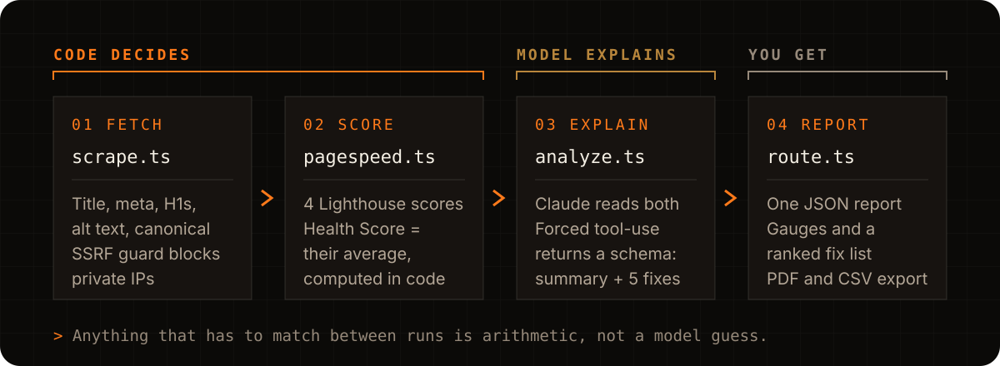

<div align="right">

**English** · [العربية](README.ar.md)

</div>

<p align="center">
  <a href="https://ai-website-auditor-indol.vercel.app">
    
  </a>
</p>

<p align="center">
  <a href="https://ai-website-auditor-indol.vercel.app"></a>
  
  
  
  
</p>

<p align="center">
  <a href="https://ai-website-auditor-indol.vercel.app"><b>Open the live demo</b></a> ·
  <a href="#run-it-locally">Run it locally</a> ·
  <a href="#how-an-audit-runs">How it works</a>
</p>

Paste a URL and the auditor returns a Health Score, a breakdown of
performance, accessibility, SEO and best practices from Google PageSpeed
Insights, a short Claude-written summary, and a severity-ranked list of
fixes. You can export the report as PDF or CSV.

## A real run

<p align="center">
  
</p>

This is the live app auditing stripe.com. The four category scores come
straight from PageSpeed. The 73 in the middle is their average, rounded.

## The core design decision

The model never produces the Health Score. The code takes the four real
PageSpeed scores and runs `Math.round()` on their average, so the same site
gets the same score on every audit. Claude writes the summary and the fix
list and nothing else.

The rule this project demonstrates: the model explains, the code decides
anything that has to stay consistent between runs.

## How an audit runs

<p align="center">
  
</p>

<details>
<summary><b>File-by-file walkthrough</b></summary>

1. **`lib/scrape.ts`** fetches the target page and extracts on-page SEO
   signals with `cheerio`: title, meta description, H1 count, alt-text
   coverage, canonical tag, viewport meta and word count.
2. **`lib/pagespeed.ts`** calls the PageSpeed Insights API (mobile
   strategy) for the four category scores, retries transient 5xx errors up
   to three times, and computes the Health Score as their average.
3. **`lib/analyze.ts`** sends the scrape and PageSpeed data to Claude with
   forced tool-use (`tool_choice: { type: 'tool' }`). The response is
   always a structured object that matches the `submit_audit_report`
   schema, never free text to parse.
4. **`app/api/audit/route.ts`** runs the pipeline and returns one JSON
   report.
5. **`app/page.tsx` + `app/components/*`** render the URL form, the
   animated Health Score gauge, the category breakdown, the
   severity-badged fix list, and PDF (browser print) and CSV export.

</details>

## Safe to point at any URL

The auditor fetches whatever public URL a visitor types, so `lib/scrape.ts`
treats that input as hostile:

- **SSRF protection.** It resolves DNS first, blocks private, loopback,
  link-local and IPv4-mapped IPv6 ranges, then pins the connection to the
  checked IP. A public hostname that resolves to `169.254.169.254` gets
  rejected.
- **Redirects.** It follows up to 5 redirects by hand and re-checks every
  hop, so a public URL cannot redirect into an internal address.
- **Limits.** Each fetch times out after 15 seconds and stops reading at 5 MB.
- **CSV export.** It escapes cells that start with `=`, `+`, `-` or `@`
  to prevent formula injection in spreadsheet apps.

## Run it locally

You need Node.js, an [Anthropic API key](https://console.anthropic.com)
and a [Google Cloud key](https://console.cloud.google.com) with the
PageSpeed Insights API enabled.

```bash
npm install
cp .env.local.example .env.local
# set ANTHROPIC_API_KEY and PAGESPEED_API_KEY in .env.local
npm run dev
```

Run the test suite:

```bash
npm test
```

## Stack

Next.js 16 (App Router), TypeScript, Tailwind CSS 4, Google PageSpeed
Insights API, Anthropic API (`claude-sonnet-5` with forced tool-use),
Vitest and Testing Library.

<details>
<summary><b>Roadmap</b></summary>

- Persist past audits (Postgres or Supabase) so a user can reopen a report by link.
- Competitor mode: audit two URLs and diff the fixes.
- AI-crawler (GEO) visibility check: can ChatGPT, Perplexity or Gemini find and cite the page.
- Weighted Health Score once real usage shows which category should count more.
- Mobile and desktop PageSpeed toggle instead of mobile only.
- Per-IP rate limiting (Vercel KV) once the tool sees real traffic.

</details>

---

<p align="center">
  Built and designed by <b>Mohammed Altounsi</b> · <a href="https://www.linkedin.com/in/mohammed-altounsi/">LinkedIn</a>
</p>
